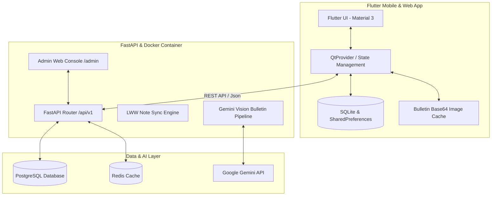

# ✝️ 명선아이워십 (Myungsun iWorship)

> **"울림과 떨림으로 드리는 예배, 누림과 살림이 가득한 삶"**  
> 명선교회 청·장년 말씀 묵상(QT) 및 주보 자동 정렬·동기화 통합 플랫폼

---

## 📌 1. 프로젝트 개요 (Project Overview)

**명선아이워십(iWorship)**은 명선교회 성도들의 매일 말씀 묵상(QT) 작성과 매주일 주보 조회를 오프라인 퍼스트(Local-First) 환경에서 원활하게 지원하는 **맞춤형 모바일 웹/앱 및 스마트 백엔드 플랫폼**입니다.

* **교인용 모바일 앱**: 네트워크 연결이 불안정한 환경에서도 **0.01초 만에 로컬 캐시**로 묵상 본문과 주보 이미지를 즉시 렌더링하며, 백그라운드 비동기 통신을 통해 서버 최신 데이터 및 개인 작성 노트를 **LWW (Last-Write-Wins) 방식**으로 안전하게 동기화합니다.
* **스마트 관리자 시스템**: 주보 이미지 업로드 시 **Google Gemini AI Vision 배치 연동 알고리즘**이 표지 날짜를 자동 식별하고 4개 지면(표지, 설교, 공지, 소식)을 자동 분류 및 크롭합니다. 분류 오류 발생 시 관리자 웹 콘솔에서 **`◀ 이전` / `다음 ▶`** 버튼 클릭 한 번으로 지면 순서를 손쉽게 교환(Reorder)할 수 있습니다.

---

## 🏗️ 2. 시스템 아키텍처 (System Architecture)



---

## 🛠️ 3. 기술 스택 (Tech Stack)

### 📱 Frontend (Mobile & Web)
| 구분 | 기술 스택 | 설명 |
|---|---|---|
| **Framework** | **Flutter 3.22+** | iOS, Android, Web 멀티플랫폼 지원 |
| **State Management** | **Provider** | 반응형 상태 관리 및 중앙 데이터 파이프라인 |
| **Local Storage** | **SQLite (sqflite)**, **SharedPreferences** | 묵상 노트 및 주보 Base64 영구 캐싱 (Local-First) |
| **Network & Sync** | **Dio** | REST API 통신, `Uri.base.origin` 동적 IP 자동 감지 |
| **Design System** | **Material 3 / Custom CSS** | 퍼플 파스텔 컬러 Palette (`#7C6893`, `#645179`), Pretendard 서체 |

### ⚙️ Backend & Infrastructure
| 구분 | 기술 스택 | 설명 |
|---|---|---|
| **Framework** | **Python FastAPI**, **Uvicorn** | 고성능 비동기 REST API 서버 |
| **Database** | **PostgreSQL 15**, **SQLModel / SQLAlchemy** | 비동기 ORM (`asyncpg`) 데이터베이스 |
| **Cache & Queue** | **Redis** | 세션 및 API 요청 캐싱 |
| **AI Integration** | **Google Gemini API (Vision)** | 이미지 1회 배치 파싱 (Single-Call Batch Classification) |
| **Containerization** | **Docker**, **Docker Compose** | 컨테이너 기반 서버 멀티 서비스 오케스트레이션 |

---

## ✨ 4. 주요 기능 (Key Features)

### 1) ⚡ 0.01초 오프라인 퍼스트 (Local-First) 렌더링 & 백그라운드 동기화
* 앱 접속 즉시 인터넷 통신 대기 없이 스마트폰 로컬 저장소에 저장된 QT 본문과 주보 4개 지면을 **0.01초 만에 화면에 렌더링**.
* 앱 구동 후 백그라운드 비동기 루틴이 서버의 신규 업데이트 유무를 자동으로 체크하여 최신 데이터로 로컬 캐시를 갱신.
* 성도가 작성한 묵상 노트는 Device ID 기반 **LWW (Last-Write-Wins) 충돌 해결 알고리즘**을 거쳐 서버 백업 DB와 실시간 동기화.

### 2) 🔒 관리자 콘솔 로그인 보호 & 비밀 이스터에그 인증 (`/admin`)
* **관리자 로그인 모달**: 외부 접근 방지를 위해 기본 지정 계정(`admin` / `myungsun1!`) 로그인 보안 적용.
* **이스터에그 비밀 로그인**: ID 입력 상태에서 '비밀번호' 텍스트를 10회 연타 시 안내 팝업 없이 즉시 보안 로그인 승인.
* **주보 4지면 개별 선택 & Reorder**: 4개 지면(표지, 설교, 공지, 소식) 개별 드롭다운 지정 및 원클릭 순서 교환 기능 제공.

### 3) 📖 주일 / 평일 맞춤형 QT 묵상 양식
* **평일 묵상 양식**: 본문 묵상, 우모하 기도발전소(주간 공동체 기도), 아로새길 말씀 선택 자동 입력, 오늘의 감사, 적용 및 기도.
* **주일 묵상 양식**: 주일 IBS (3가지 나눔 질문) 양식 제공 및 단일 **주일 설교 NOTE (설교 제목 & 메시지 메모)** 통합 카드 UI 제공.
* **구절 묵상 메모 상시 노출**: 선택한 구절에 작성된 묵상 메모는 선택 해제 시에도 `✔️ 작성됨` 표시와 함께 구절 하단 상시 보임 상태 유지 (`isVerseSelected || hasMemo`).

### 4) 💾 실시간 타이핑 자동 저장 & 앱 종료 후 100% 자동 복원
* **실시간 저장**: 묵상 작성란 및 설교 노트 입력 시 타이핑 즉시 로컬 저장소에 자동 적재.
* **앱 종료 후 재실행 보존**: 앱을 종료하거나 날짜를 이동하더라도 이전에 작성했던 모든 묵상글 및 설교 제목이 1초 만에 컨트롤러로 복원.
* **한글 자모 분리 방지 (CJK IME Fix)**: 실시간 저장 시 `saveUserNoteSilently` 무소음 헬퍼를 적용하여 조합 중 한글이 `ㅁㅏㄹㅅㅡㅁ`으로 쪼개지는 현상 완전 해결.

### 5) 🧭 여정 탭 피드 실시간 반영 & 묵상 탭 점프 UX
* **실시간 피드 갱신**: 묵상 탭에서 글 작성 후 `🧭 여정` 탭 전환 시 앱 재시작 없이 1초 만에 달력 완주 체크 및 작성 글 피드가 실시간 반영.
* **원클릭 묵상 탭 점프**: 여정 탭 상단 달력 박스나 하단 피드 카드를 누르면 해당 날짜 선택과 동시에 `📖 묵상` 탭으로 1초 만에 즉시 이동.
* **달력 시작 요일 정밀 계산 & 월 이동 화살표 (`<`, `>`)**: 매월 1일의 실제 시작 요일(예: 8월 1일=토요일) 오프셋을 정확히 계산하여 달력 표시 및 월 이동 버튼 지원.

### 6) ☁️ 기기 변경 / 전화번호(Sync ID) 1:1 서버 백업 & 복원 (Push / Pull)
* **전화번호 백업/복원**: 개발자 모드(타이틀 10회 연타)에서 본인 전화번호를 동기화 코드로 입력 후 원클릭으로 서버에 전체 묵상 일지 백업(Push) 및 새 기기 복원(Pull) 가능.
* **양방향 필드 호환 레이어**: `SharedPreferences` + `SQLite DB` + 메모리 3중 통합 스캔 및 백엔드 필드 매핑으로 데이터 손실 없이 100% 완벽 복원.
* **독립 APK 다운로드 제공**: 안드로이드 전용 최신 배포 파일(`http://168.110.63.231:8000/static/app-release.apk`) 제공.

### 7) 🖼️ 시그니처 수채화 표지 스플래시 로딩 (Splash Screen)
* 실제 **'아이워십 청·장년용'** 교재의 수채화 명선교회 그림과 하단 손글씨 캘리그라피 문구를 화면 크기에 맞게 중앙 정렬(`BoxFit.contain`)하고, 하늘색 톤 배경(`Color(0xFF5C7B9E)`)과 조화롭게 배치한 감성 스플래시 화면 구동.

---

## 📂 5. 프로젝트 디렉토리 구조 (Directory Structure)

```text
iworship/
├── backend/                        # FastAPI 백엔드 프로젝트
│   ├── app/
│   │   ├── admin_static/           # 관리자 웹 콘솔 HTML/JS/CSS (/admin)
│   │   ├── flutter_web/            # 빌드된 Flutter Web 정적 파일 (/app)
│   │   ├── static/                 # 배포용 최신 APK 다운로드 파일 (/static/app-release.apk)
│   │   ├── models/                 # SQLModel DB 테이블 데이터 구조
│   │   ├── routers/                # REST API 엔드포인트 (admin, qt, bulletin)
│   │   └── services/               # Gemini AI 파이프라인 서비스
│   ├── docker-compose.yml          # Docker 서버 서비스 구성
│   └── Dockerfile
├── iworship_mobile/                # Flutter 모바일/웹 앱 프로젝트
│   ├── assets/                     # 브랜드 로고 및 스플래시 표지 이미지
│   ├── lib/
│   │   ├── models/                 # Dart 데이터 모델 (DailyScripture, UserNote 등)
│   │   ├── providers/              # QtProvider 상태 관리 및 동적 IP 감지
│   │   ├── screens/                # UI 화면 (HomeScreen, QtViewScreen, JourneyScreen 등)
│   │   └── services/               # ApiService, DatabaseHelper, BulletinCacheService
│   ├── web/                        # Flutter Web PWA 패키징 파일 (index.html, manifest.json)
│   └── pubspec.yaml
└── README.md
```

---

## 🚀 6. 실행 및 배포 가이드 (Getting Started)

### 1) 백엔드 서버 실행 (Docker)
```bash
cd backend
# 환경 변수 설정 (.env 파일에 GEMINI_API_KEY 입력)
echo "GEMINI_API_KEY=your_gemini_api_key" > .env

# Docker 컴포즈 실행
docker compose up -d --build
```
* **관리자 웹 콘솔**: `http://localhost:8000/admin`
* **모바일 웹 앱**: `http://localhost:8000/app/`
* **Swagger API 문서**: `http://localhost:8000/docs`
* **APK 직접 다운로드**: `http://localhost:8000/static/app-release.apk`

### 2) 모바일 앱 빌드 & 배포 (Flutter)
```bash
cd iworship_mobile

# 패키지 설치
flutter pub get

# 1. Flutter Web 빌드 및 백엔드 적용
flutter build web --base-href "/app/"
rsync -av --delete build/web/ ../backend/app/flutter_web/

# 2. 안드로이드 APK 파일 빌드 및 배포
flutter build apk --release
cp build/app/outputs/flutter-apk/app-release.apk ../backend/app/static/

# 3. 서버 재부팅
cd ../backend && docker compose restart web
```

---

## 📄 7. 라이선스 및 저작권 (License)

* 본 프로젝트의 소스코드는 **명선교회** 말씀 묵상 및 주보 서비스를 위해 제작되었습니다.
* 교재 이미지 및 캘리그라피 문구의 저작권은 명선교회에 있습니다.
